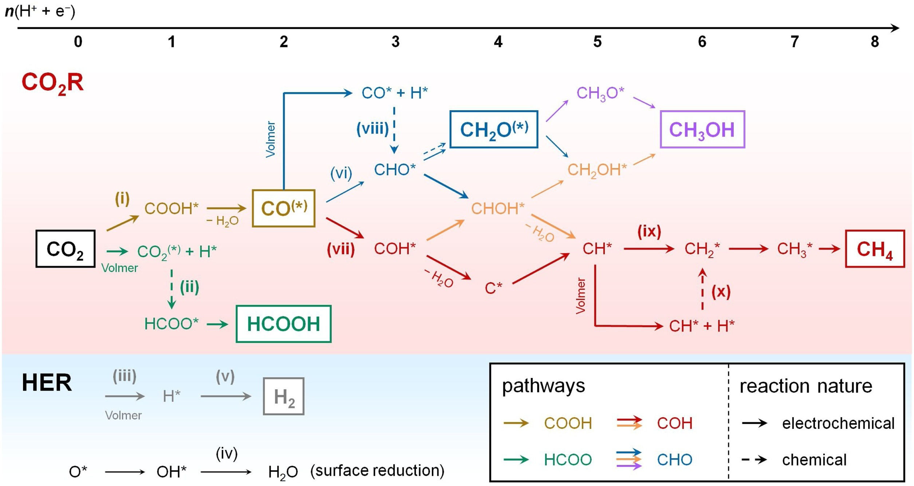

# GDY-SAC

Python and perl scripts to assist tasks in GDY-SAC and CO2RR adsorption modelling.

## Adsorbates

### Path (i) and (vi)

- [x] CO2
- [x] COOH
- [x] CO
- [x] CHO
- [ ] CH2O
- [x] CH3O
- [ ] CH3OH

### Path (ii)

- [x] HCOO
- [x] HCOOH

### Path  (vii)

- [x] COH
- [x] CHOH
- [ ] CH2OH
- [ ] C
- [ ] CH
- [ ] CH2
- [ ] CH3
- [ ] CH4

### HER

- [ ] O
- [ ] OH
- [ ] H2O
