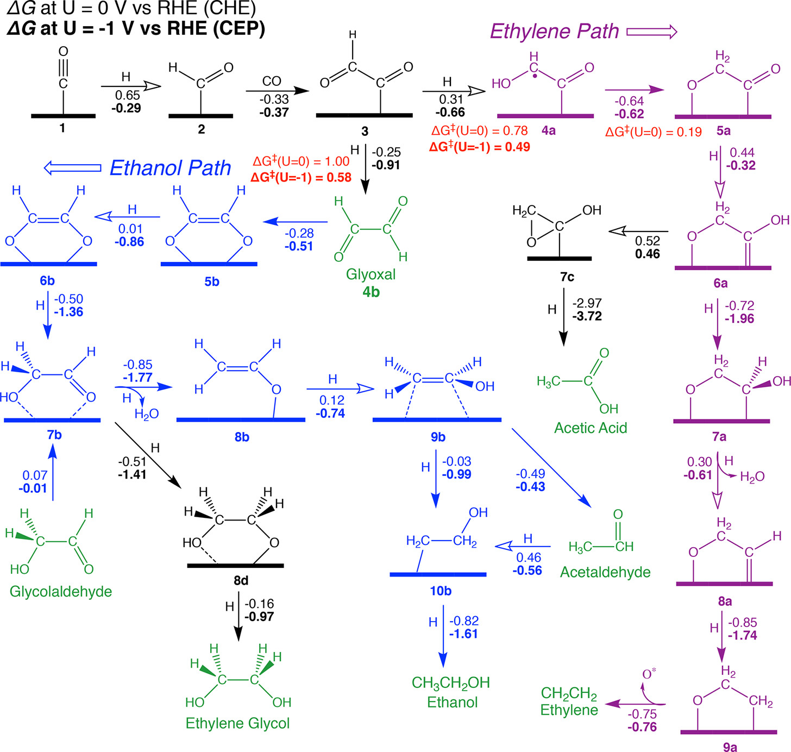

# GDY-SAC

Python and perl scripts to assist tasks in GDY-SAC and CO2RR adsorption modelling.

---

## New

Rewriting to better perform adsorbate molecule placing in the GDY lattice.

### Module: msiProcessor

- DataStructs.py
  - Data structure of atom, adsorbate molecule and the GDY lattice
  - Atom is the basic unit for molecule and lattice
- my_maths.py
  - About coordinate manipulation
    - Rotation Matrix
    - Rotate around center
- parser.py
  - Load molecule file and lattice file
- model_builder.py
  - Perform actions of placing adsorbate in target positions.
  - Cases:
    - Single coordinating site (few)
      - Move along on top of the carbon chain, and the metal site
    - Double coordinating site (main tasks for C2 pathway)
      - Two-by-two mounting along the carbon chain and ring
        - 1,2,3,4, far_ring (next to 4), close_ring (next to 1)
      - Two-by-two mounting between the metal and adjacent two carbons
        - 1,2
        - 2,3
        - 3,4
        - 4, far_ring
        - close_ring, 1
        - 1, metal
        - 2, metal

---

## Usage

1. gen_ads_model.py

   - mode:

   1. model: Generate adsorbate attached models in .msi format
   2. to_xsd: Generate perl script to be executed by Materials Studio, generating .xsd format files.

2. gen_castep_seed.py: Generate necessary input files for running CASTEP. Including:

   1. \*.param and \*\_DOS.param : parameter files of CASTEP.
   2. \*.cell and \*\_DOS.cell : structure input files for CASTEP.
   3. \*.trjaux and \*.kptaux: trajectory auxiliary files and k-point auxiliary files.
   4. Copy corresponding potential files into the directory.
   5. Generate the CASTEP setting xml file (SMCASTEP\*.xms)
   6. Generate the pbs queuing system script (hpc.pbs.sh)

3. get_cellinfo.py: Extract necessary information in .cell file of the metal elements. For reuse in gen_castep_seed.py

4. create_model.py: Modify the metal element in the template SAC_GDY_Sc.xsd to create the GDY SAC models with various metal elements.

## Adsorbates (C1 Pathway)

### Path (i) and (vi)

- [x] CO2
- [x] COOH
- [x] CO
- [x] CHO
- [x] CH2O
- [x] CH3O
- [x] CH3OH

### Path (ii)

- [x] HCOO
- [x] HCOOH

### Path (vii)

- [x] COH
- [x] CHOH
- [x] CH2OH
- [x] C
- [x] CH
- [x] CH2
- [x] CH3
- [x] CH4

### HER

- [x] O
- [x] OH
- [x] H2O

## Adsorbates C2 pathway

> ACS Catal. 2018, 8, 2, 1490–1499.

- General
  - [x] CO
  - [x] CHO
  - [ ] COCHO
- [ ] Ethylene Path
  - [ ] COCHOH (radical)
  - [ ] OCCH2O
  - [ ] HOCCH2O
    - [ ] OH-(CCH2O)
    - [ ] CH3COOH (Acetic Acid)
  - [ ] HOCHCH2O
  - [ ] HCCH2O
  - [ ]

## Done: CASTEP input files generation (2021-08-06)

Workflow:

1. Molecule insertion scripts: generate adsorption structure msi
2. Generate .cell file: Coordinates, important settings, **specification of potential files**, LCAO
   - Construct table for:
     1. Element Spin
     2. Corresponding potential files
     3. LCAO setting
     4. Mass
3. Generate .param file:
   - Modifications:
     1. cut_off_energy: depends on the highest value from potential files. 1.1\* fine
     2. nextra_band: change to perc_extra_bands
     3. Spin: corresponds to the .cell
4. Run get_potentials.py and write_pbs_scripts.py
