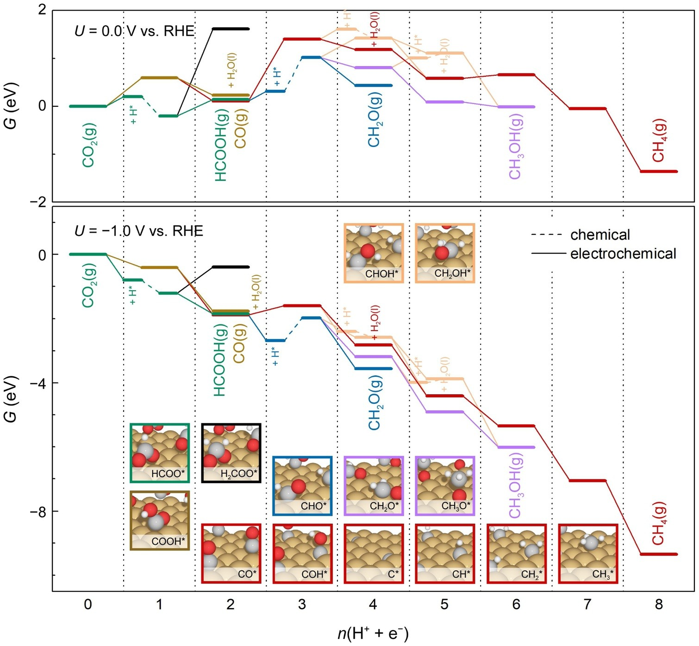

# GDY-SAC

Python and perl scripts to assist tasks in GDY-SAC and CO2RR adsorption modelling.

## Adsorbates

### Path (i) and (vi)

- [x] CO2
- [x] COOH
- [x] CO
- [x] CHO
- [x] CH2O
- [x] CH3O
- [x] CH3OH

### Path (ii)

- [x] HCOO
- [x] HCOOH

### Path (vii)

- [x] COH
- [x] CHOH
- [x] CH2OH
- [x] C
- [x] CH
- [x] CH2
- [x] CH3
- [x] CH4

### HER

- [x] O
- [x] OH
- [x] H2O

## Bug log

### 2021/07/17

Wrong atom order in msi files, causing undesired adsorption contact position of the molecules.

Checked fine: HCOOH, HCOO

Fix:

- [x] CH2
- [x] CH3
- [x] CH4
- [x] CH3OH

## Developing: CASTEP input files generation

Workflow:

1. Molecule insertion scripts: generate adsorption structure msi
2. Generate .cell file: Coordinates, important settings, **specification of potential files**, LCAO
   - Construct table for:
     1. Element Spin
     2. Corresponding potential files
     3. LCAO setting
     4. Mass
3. Generate .param file:
   - Modifications:
     1. cut_off_energy: depends on the highest value from potential files. 1.1* fine
     2. nextra_band: change to perc_extra_bands
     3. Spin: corresponds to the .cell
4. Run get_potentials.py and write_pbs_scripts.py 
